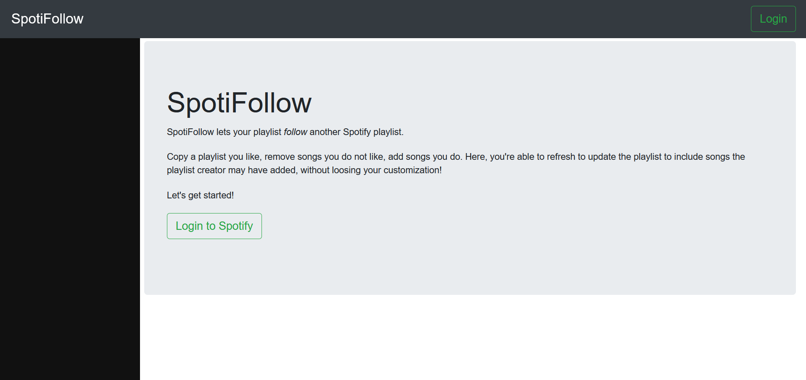
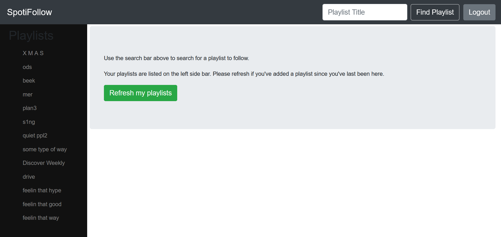
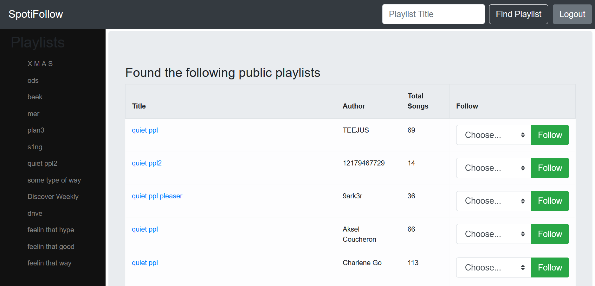
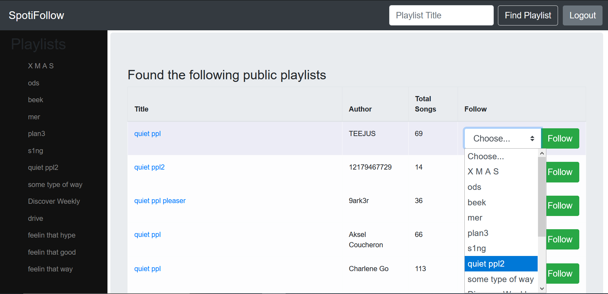
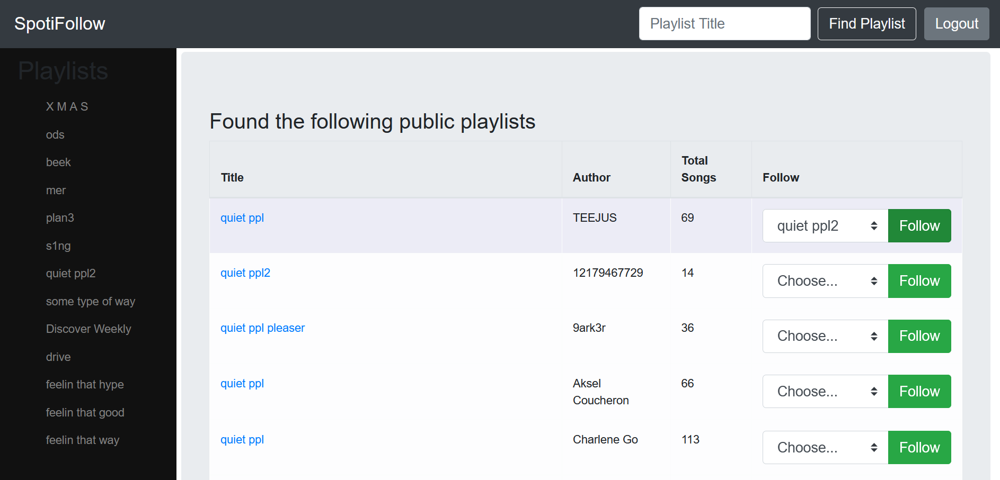
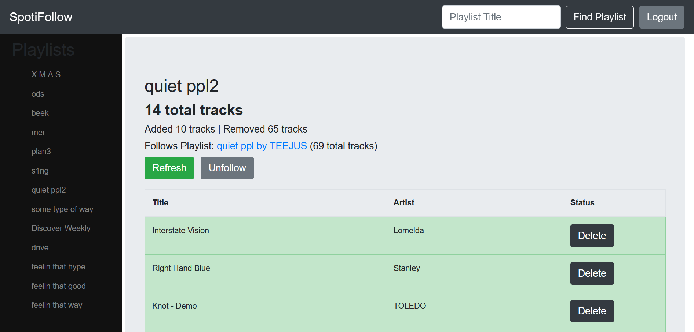
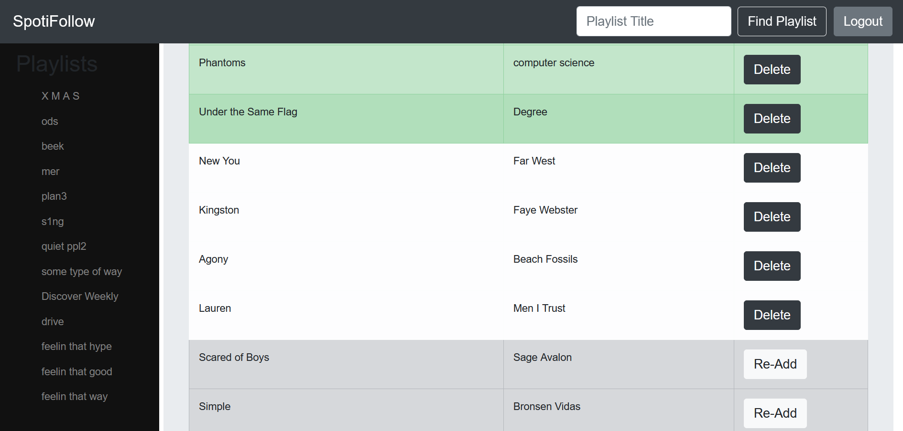
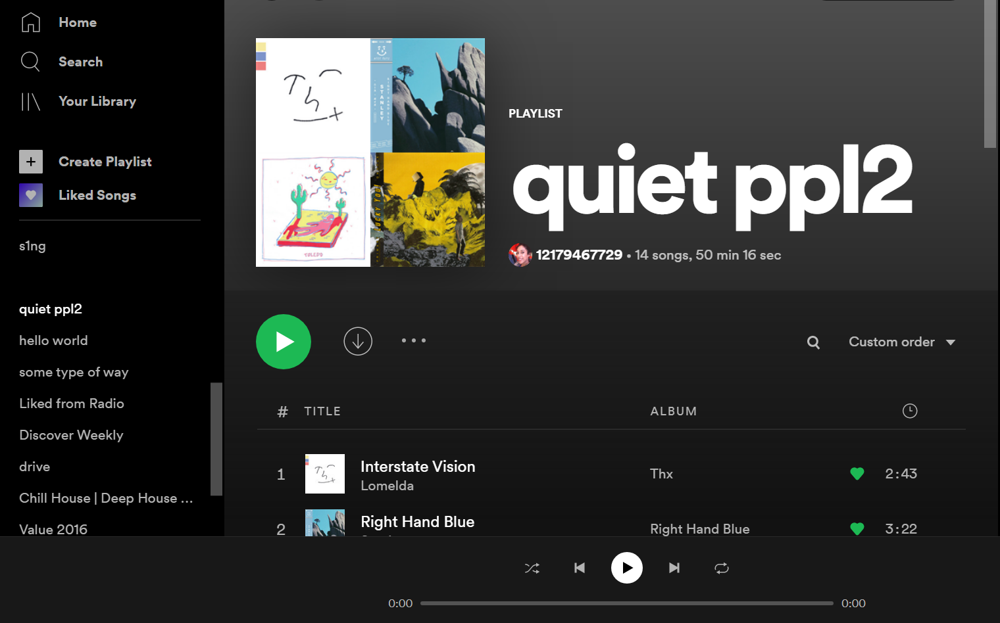

# Spotifollow

This web app allows users to sign in with their Spotify account and "follow" another user's playlist.

A copy of their playlist will be made to your account so you can add or remove songs at your leisure. On the web app, users can update the playlist to match any changes made to the original playlist, while maintaining any of your removals or additions.

## Getting Started

This web app was hosted on an AWS EC-2 instance which has been closed down for the meantime because it was costing $$$ :moneybag:

The web app is now on Heroku! 🎉

### Looks

For now, you can see how it works with these fun screenshots!

Landing page where you can sign in using Spotify authentication

After signing in, you can view your playlists and search for other playlists to follow
(I get creative with my playlist titles, what can I say)

After searching for a playlist (image below searched for "quiet ppl" playlist), you will be shown a list of matched playlists

You can select one of your playlists to follow

And you'll be taken to your updated playlist 

The green rows represent tracks that you added and are not on the playlist you're following.
The white rows are tracks that you've kept from the playlist you're following.
The grayed out rows represent tracks that you removed from the playlist you're following.

Et viola! You should see the same reflected in the Spotify app

## Built With

* [Django](https://www.djangoproject.com)
* [Nginx](https://www.nginx.com)
* [Gunicorn](https://gunicorn.org)

# Author

* **Samina Hussain**
